```mermaid
gantt
    title Azure Migration Workshop (10:00 - 17:00)
    dateFormat HH:mm
    axisFormat %H:%M
    
    section Morning
    Welcome & Azure 101        :welcome, 10:00, 15m
    Scenario Introduction      :scenario, 10:15, 15m
    Challenge 1 - Plan         :crit, c1, 10:30, 45m
    Challenge 2 - Appliance    :active, c2, 11:15, 75m
    
    section Break
    Lunch (Discovery runs)     :lunch, 12:30, 45m
    
    section Afternoon
    Challenge 3 - Assessment   :active, c3, 13:15, 45m
    Challenge 4 - Execute      :crit, c4, 14:00, 30m
    Coffee Break               :break, 14:30, 15m
    Challenge 5 - Curveball    :milestone, c5, 14:45, 0m
    Challenge 6 - Optimize     :c6, 15:15, 45m
    Challenge 7 - Presentations:done, c7, 16:00, 60m
```

# Workshop Agenda

## 1-Day Azure Migration Workshop

**Total Duration**: 7 hours (10:00 - 17:00)  
**Format**: Hands-on labs + Whiteboard Design Sessions  
**Scoring**: 100 points competitive leaderboard

---

## Visual Timeline



---

## Morning Session

### 10:00 - 10:15 | Welcome & Introductions (15 min)

> **Type**: Facilitated | **Points**: —

- Welcome and team introductions
- Workshop objectives and format
- Quick Azure portal orientation (assumes Azure 101 pre-work completed)
- Locating Azure Migrate

**Outcome**: All teams aligned and ready to start

---

### 10:15 - 10:30 | Scenario Introduction (15 min)

> **Type**: Facilitated | **Points**: —

- Contoso Bakery case study presentation
- Team formation (self-organizing, 4 per team)
- ArcBox environment walkthrough

**Outcome**: Teams understand the migration challenge

---

### 10:30 - 11:15 | Challenge 1: Plan (45 min)

> **Type**: Whiteboard Design Session | **Points**: 25

- Assessment strategy design
- Dependency mapping approach
- Migration wave prioritization matrix
- Deliverable: Photographed whiteboard with wave plan

**CAF Phase**: Plan

---

### 11:15 - 12:30 | Challenge 2: Deploy Appliance (75 min)

> **Type**: Hands-on Lab | **Points**: 25

- Create Azure Migrate project
- Generate project key
- Import Azure Migrate VHD to Hyper-V
- Configure and register appliance
- Add credentials (Windows, Linux, SQL)
- Start discovery

**CAF Phase**: Prepare

---

### 12:30 - 13:15 | 🍽️ Lunch (45 min)

> Discovery continues in background

---

## Afternoon Session

### 13:15 - 14:00 | Challenge 3: Assessment (45 min)

> **Type**: Hands-on Lab | **Points**: 20

- Verify discovered servers in Azure portal
- Create Azure VM assessment (performance-based)
- Create Azure SQL assessment
- Interpret readiness status
- Export and document key findings

**CAF Phase**: Execute (Assessment)

---

### 14:00 - 14:30 | Challenge 4: Execute (30 min)

> **Type**: Whiteboard Design Session | **Points**: 15

- Tool selection per workload type
- Migration sequencing plan
- Rollback strategy design
- Deliverable: Migration runbook outline

**CAF Phase**: Execute (Planning)

---

### 14:30 - 14:45 | ☕ Break (15 min)

---

### 14:45 - 15:15 | Challenge 5: Curveball 🎲 (30 min)

> **Type**: Whiteboard Design Session | **Points**: 10

- **SURPRISE ANNOUNCEMENT** at 14:45
- Teams adapt their migration plan
- Address new compliance requirements
- Update target architecture

**CAF Phase**: Execute (Adaptation)

---

### 15:15 - 16:00 | Challenge 6: Optimize (45 min)

> **Type**: Whiteboard Design Session | **Points**: —

- Cost estimation and optimization
- Reserved Instance strategy
- Right-sizing recommendations
- Azure Arc for remaining on-prem workloads
- Governance design (policies, management groups)

**CAF Phase**: Optimize

---

### 16:00 - 16:45 | Challenge 7: Presentation (45 min)

> **Type**: Team Presentations | **Points**: 5

- 8-minute chalk-talk per team
- 3 mandatory objections to address:
  1. PaaS vs IaaS justification
  2. Rollback procedure
  3. GDPR compliance approach
- Peer appreciation

**CAF Phase**: All (Synthesis)

---

### 16:45 - 17:00 | Wrap-up (15 min)

> **Type**: Facilitated | **Points**: —

- 🏆 Leaderboard reveal and winner announcement
- Key takeaways and lessons learned
- Resource cleanup (run cleanup script)
- Feedback form completion
- Q&A

---

## Visual Timeline

```
10:00 ─────────────────────────────────────────────────────────── 17:00
│                                                                    │
├─ C0 ─┼─ Intro ─┼── C1: Plan ──┼────── C2: Appliance ──────┼─ Lunch ─┤
│ 15m  │  15m   │     45m       │         75m               │   45m   │
│                                                                      │
├───── C3: Assess ─────┼── C4: Execute ──┼─ Break ─┼─ C5: Curveball ──┤
│        45m           │      30m        │  15m    │       30m        │
│                                                                      │
├──── C6: Optimize ────┼───── C7: Present ─────┼─────── Wrap-up ──────┤
│        45m           │        45m            │         15m          │
```

---

## Points Summary

| Challenge | Duration | Type | Points |
|-----------|----------|------|--------|
| Pre-work: Azure 101 | 30 min | Self-paced | — |
| Challenge 1: Plan | 45 min | WDS | 25 |
| Challenge 2: Appliance | 75 min | Hands-on | 25 |
| Challenge 3: Assessment | 45 min | Hands-on | 20 |
| Challenge 4: Execute | 30 min | WDS | 15 |
| Challenge 5: Curveball | 30 min | WDS | 10 |
| Challenge 6: Optimize | 45 min | WDS | — |
| Challenge 7: Presentation | 45 min | Present | 5 |
| **Total** | **7 hours** | | **100** |
| Bonus Opportunities | — | — | +15 |

---

## Facilitator Notes

- **Pre-event**: Deploy ArcBox environments (see [Pre-Deployment Guide](docs/audiences/facilitator/pre-deployment-guide.md))
- **14:45 sharp**: Announce curveball (see [Curveball Script](docs/audiences/facilitator/curveball-script.md))
- **Throughout**: Use [Scoring Rubric](docs/audiences/facilitator/scoring-rubric.md) for consistent evaluation
- **End of day**: Run cleanup scripts, collect feedback

---

**Complete before workshop**: [Pre-work: Azure 101](docs/challenges/00-azure-101.md)
