# Azure Migration Workshop: From On-Premises to Azure

A **1-day hands-on workshop** for IT Professionals combining Azure Migrate appliance labs with whiteboard design sessions, aligned to the [Cloud Adoption Framework Migrate methodology](https://learn.microsoft.com/azure/cloud-adoption-framework/migrate/).

## 🎯 Workshop Overview

| Attribute | Details |
|-----------|---------|
| **Duration** | 1 day (7 hours: 10:00 - 17:00) |
| **Format** | In-person, team-based |
| **Team Size** | 4 people per team (self-organizing) |
| **Scoring** | 100 points + bonus opportunities |
| **Lab Environment** | [Azure Jumpstart ArcBox for IT Pros](https://jumpstart.azure.com/azure_jumpstart_arcbox/ITPro) (simulated on-prem) |

## 🏆 Learning Objectives

By the end of this workshop, participants will be able to:

- **Discover** on-premises workloads using Azure Migrate appliance
- **Assess** migration readiness for VMs and SQL databases
- **Design** a migration strategy using CAF Migrate methodology
- **Plan** migration waves with dependency mapping
- **Optimize** for cost, governance, and hybrid scenarios with Azure Arc
- **Respond** to real-world constraints (compliance, cost, dependencies)

## 📋 Prerequisites

### For Participants

- [ ] Basic Azure portal familiarity (complete [Pre-work: Azure 101](docs/challenges/00-azure-101.md) beforehand)
- [ ] Laptop with modern browser (Edge or Chrome recommended)
- [ ] Access to team's Azure subscription (provided by facilitator)

### For Facilitators

- [ ] Pre-deployed ArcBox ITPro environment per team
- [ ] Azure subscription with Owner access per team
- [ ] Completed [Pre-Deployment Guide](docs/audiences/facilitator/pre-deployment-guide.md)

## 🗺️ Workshop Flow

```mermaid
graph LR
    subgraph "Morning - CAF Plan & Prepare"
        C0[Pre-work<br/>Azure 101] -.-> C1[Challenge 1<br/>Plan & Design]
        C1 --> C2[Challenge 2<br/>Deploy Appliance]
    end
    
    subgraph "Afternoon - CAF Execute & Optimize"
        C2 --> C3[Challenge 3<br/>Assess Workloads]
        C3 --> C4[Challenge 4<br/>Migration Strategy]
        C4 --> C5[Challenge 5<br/>🎲 Curveball]
        C5 --> C6[Challenge 6<br/>Optimize & Govern]
        C6 --> C7[Challenge 7<br/>Present]
    end
```



## 📁 Repository Structure

```
azure-migrate-wds/
├── README.md                    # You are here
├── AGENDA.md                    # Detailed schedule
├── feedback-form.md             # Workshop feedback form
├── docs/                        # Canonical workshop documentation tree
│   ├── workshop/                # Workshop hub
│   ├── challenges/              # Challenges 00-07
│   ├── audiences/               # Participant and facilitator docs
│   └── operations/scripts/      # Script documentation
└── scripts/                     # PowerShell automation scripts
```

## 🚀 Quick Start

### Participants

1. Review [Pre-Work Checklist](docs/audiences/participant/pre-work-checklist.md)
2. Read [Scenario Brief](docs/audiences/participant/scenario-brief.md)
3. Print [Quick Reference Card](docs/audiences/participant/quick-reference-card.md)
4. Ensure [Pre-work: Azure 101](docs/challenges/00-azure-101.md) is complete, then start Challenge 1

### Facilitators

1. Complete [Pre-Deployment Guide](docs/audiences/facilitator/pre-deployment-guide.md) (day before)
2. Review [Facilitator Guide](docs/audiences/facilitator/facilitator-guide.md)
3. Prepare [Scoring Rubric](docs/audiences/facilitator/scoring-rubric.md)
4. Keep [Curveball Script](docs/audiences/facilitator/curveball-script.md) secret until 14:45!

## 🏅 Scoring Overview

| Challenge | Points | Focus Area |
|-----------|--------|------------|
| Challenge 1: Plan | 25 | Assessment strategy, wave prioritization |
| Challenge 2: Appliance | 25 | Azure Migrate deployment, discovery |
| Challenge 3: Assessment | 20 | Readiness analysis, findings |
| Challenge 4: Execute | 15 | Tool selection, rollback planning |
| Challenge 5: Curveball | 10 | Adapt to GDPR compliance |
| Challenge 7: Presentation | 5 | Chalk-talk, objection handling |
| **Total** | **100** | |
| Bonus | +15 | Arc, cost optimization, security |

## 🔗 Key Resources

- [Cloud Adoption Framework - Migrate](https://learn.microsoft.com/azure/cloud-adoption-framework/migrate/)
- [Azure Migrate Documentation](https://learn.microsoft.com/azure/migrate/)
- [Azure Jumpstart ArcBox](https://jumpstart.azure.com/azure_jumpstart_arcbox/ITPro)
- [Azure Well-Architected Framework](https://learn.microsoft.com/azure/well-architected/)

## 📞 Support

- **During Workshop**: Raise hand for facilitator assistance
- **Technical Issues**: Check [Hints and Tips](docs/audiences/participant/hints-and-tips.md)
- **Post-Workshop**: [Feedback Form](feedback-form.md)

---

**Ready to begin?** Complete the [Pre-work: Azure 101](docs/challenges/00-azure-101.md), then head to the [Agenda](AGENDA.md) for the detailed schedule.
