# Challenge 7: Presentation

> **Duration**: 45 minutes | **Type**: Team Presentations | **Points**: 5

## Objective

Present your complete migration strategy to Contoso Bakery's leadership (facilitators and peer teams) in a chalk-talk format.

---

## The Business Challenge

Contoso Bakery's Managing Director and IT Manager are meeting to approve the migration project. Your team has 8 minutes to convince them that your plan is solid, addresses their concerns, and will deliver business value.

After your presentation, you'll face 3 objections that you must handle convincingly.

---

## Presentation Format

### Chalk-Talk Style

This is NOT a slide presentation. Use your whiteboard photos and diagrams to walk through your design.

| Component | Time |
|-----------|------|
| Migration strategy overview | 3 min |
| Tool selection and sequencing | 2 min |
| Cost and governance | 2 min |
| GDPR compliance approach | 1 min |
| **Total Presentation** | **8 min** |
| Objection handling | 4 min |
| **Total Time** | **12 min** |

---

## Required Content

Your presentation must cover:

### 1. Discovery and Assessment (1 min)

- How you discovered the environment
- Key assessment findings
- Readiness summary

### 2. Migration Strategy (3 min)

- Wave plan with rationale
- Tool selection for each workload
- Timeline estimate
- Dependencies addressed

### 3. Risk and Rollback (1 min)

- Key risks identified
- Rollback triggers and procedures
- Who has authority to stop/revert

### 4. GDPR Compliance (1 min)

- How the curveball changed your plan
- Data residency approach
- Compliance controls

### 5. Cost and Optimization (1 min)

- Total monthly cost estimate
- Optimization strategies applied
- ROI/business case summary

### 6. Governance and Hybrid (1 min)

- Management structure
- Key policies
- Azure Arc strategy (if applicable)

---

## Mandatory Objections

After your presentation, facilitators will raise **3 objections** you must address:

### Objection 1: PaaS vs IaaS

> "Why are you migrating the SQL database to IaaS VMs? Shouldn't we use Azure SQL Managed Instance for better PaaS benefits?"

**Prepare to discuss**:
- Your rationale for target choice
- Trade-offs between IaaS and PaaS
- When PaaS makes sense vs IaaS

### Objection 2: Rollback Procedure

> "What happens if the web server migration fails during a critical business period? Walk me through exactly how you'd roll back."

**Prepare to discuss**:
- Specific rollback steps
- Timeline for rollback
- Data synchronization challenges

### Objection 3: GDPR Compliance

> "How can you guarantee that customer data will never leave the EU region, including backups and disaster recovery?"

**Prepare to discuss**:
- Target regions for all data
- Backup and DR strategy
- Monitoring and enforcement

---

## Success Criteria (5 Points)

| Criterion | Points | Description |
|-----------|--------|-------------|
| Clear delivery | 2 | Well-organized, within time, all content covered |
| Objections handled | 3 | Convincing responses to all 3 objections |
| **Total** | **5** | |

---

## Presentation Order

There are **4 teams**, and each team has exactly **12 minutes** (8 min presentation + 4 min objections). Strict timekeeping ensures all teams present.

| Team | Time Slot | Duration |
|------|-----------|----------|
| 🔴 Team 1 | 16:15 - 16:27 | 12 min |
| 🟠 Team 2 | 16:27 - 16:39 | 12 min |
| 🟢 Team 3 | 16:39 - 16:51 | 12 min |
| 🔵 Team 4 | 16:51 - 17:03 | 12 min |

```mermaid
gantt
    title Presentation Schedule (16:15 - 17:00)
    dateFormat HH:mm
    axisFormat %H:%M
    
    section Team 1
    Presentation    :t1p, 16:15, 8m
    Objections      :t1o, after t1p, 4m
    
    section Team 2
    Presentation    :t2p, 16:27, 8m
    Objections      :t2o, after t2p, 4m
    
    section Team 3
    Presentation    :t3p, 16:39, 8m
    Objections      :t3o, after t3p, 4m
    
    section Team 4
    Presentation    :t4p, 16:51, 8m
    Objections      :t4o, after t4p, 4m
```

> ⚠️ Time is strictly enforced. Practice to stay within 8 minutes!

---

## Tips for Success

### Do:

- ✅ Use your whiteboard photos as visual aids
- ✅ Have different team members present different sections
- ✅ Speak to the business value, not just technical details
- ✅ Acknowledge trade-offs and risks honestly
- ✅ Be concise — every second counts

### Don't:

- ❌ Read from notes word-for-word
- ❌ Go over time (you will be cut off)
- ❌ Let one person do all the talking
- ❌ Be defensive about objections — address them directly
- ❌ Make up numbers — use your actual assessment data

---

## Peer Appreciation

While other teams present, consider:

- What did they do well?
- What approach was different from yours?
- What would you adopt for future projects?

After all presentations, you'll have a chance to share appreciations.

---

## Evaluation Rubric

Facilitators will score based on:

| Category | Excellent (5) | Good (4) | Adequate (3) | Needs Work (2) |
|----------|---------------|----------|--------------|----------------|
| **Content Completeness** | All required sections covered thoroughly | Most sections covered well | Some gaps in coverage | Major sections missing |
| **Clarity** | Crystal clear, easy to follow | Clear with minor confusion | Some unclear areas | Difficult to follow |
| **Time Management** | Perfect timing | Slightly over/under | Noticeably off | Significantly off |
| **Objection Handling** | All objections addressed convincingly | Most handled well | Some weak responses | Unable to address |
| **Team Participation** | All members contributed | Most contributed | One person dominated | Single presenter |

---

## Preparation Checklist

Before presenting:

- [ ] Whiteboard photos ready to show
- [ ] Decided who presents each section
- [ ] Practiced at least once
- [ ] Prepared answers for the 3 objections
- [ ] Have your assessment data accessible

---

## After Presentations

### Leaderboard Reveal

Facilitators will tally scores and announce the final standings:

1. 🥇 **First Place**: Challenge champions!
2. 🥈 **Second Place**: Excellent work!
3. 🥉 **Third Place**: Great effort!

### Peer Appreciations

Each team shares one thing they appreciated about another team's approach.

### Key Takeaways

Facilitator-led discussion:
- What did you learn today?
- What will you apply in your real work?
- What questions remain?

---

## Reflection Questions

After all presentations:

- What different approaches did teams take?
- Which objection was hardest to answer?
- How would you improve your presentation next time?

---

## Workshop Complete! 🎉

Congratulations on completing the Azure Migration Workshop!

### Next Steps

1. **Complete the [Feedback Form](../feedback-form.md)**
2. **Cleanup resources** — Run the cleanup script
3. **Stay connected**:
   - [Azure Migrate documentation](https://learn.microsoft.com/azure/migrate/)
   - [Cloud Adoption Framework](https://learn.microsoft.com/azure/cloud-adoption-framework/)
   - [Azure Arc Jumpstart](https://azurearcjumpstart.io/)

### Take With You

- Your whiteboard photos
- Assessment export files
- This workshop repository (bookmark it!)

---

Thank you for participating! 🙏
