# ArcBox Environment Reference

This document contains details about your ArcBox lab environment.

> ⚠️ **Credentials will be provided by your facilitator on the day of the workshop.**

---

## Environment Overview

Your team has access to an [Azure Jumpstart ArcBox for IT Pros](https://jumpstart.azure.com/azure_jumpstart_arcbox/ITPro) environment. This simulates an on-premises datacenter running on Hyper-V.

### Architecture Diagram

```mermaid
flowchart TB
    subgraph Azure["☁️ Azure Cloud"]
        direction TB
        Portal["🌐 Azure Portal"]
        Migrate["📊 Azure Migrate Project"]
        Arc["🔗 Azure Arc"]
        Portal --> Migrate
        Portal --> Arc
    end

    subgraph OnPrem["🏢 Simulated On-Premises (ArcBox)"]
        direction TB
        subgraph HyperV["ArcBox-Client (Hyper-V Host)"]
            direction LR
            subgraph Windows["Windows VMs"]
                Win2K22["🖥️ ArcBox-Win2K22<br/>Windows Server 2022<br/>Application Server<br/>10.10.1.100"]
                Win2K25["🖥️ ArcBox-Win2K25<br/>Windows Server 2025<br/>File Server<br/>10.10.1.101"]
                SQL["🗄️ ArcBox-SQL<br/>Windows + SQL 2022<br/>Database Server<br/>10.10.1.102"]
            end
            subgraph Linux["Linux VMs"]
                Ubuntu01["🐧 ArcBox-Ubuntu-01<br/>Ubuntu 22.04<br/>Web Server<br/>10.10.1.103"]
                Ubuntu02["🐧 ArcBox-Ubuntu-02<br/>Ubuntu 22.04<br/>Monitoring<br/>10.10.1.104"]
            end
            subgraph Appliance["Your Deployment"]
                MigrateAppliance["🔍 Azure Migrate<br/>Appliance<br/>(You deploy this!)"]
            end
        end
    end

    subgraph Network["🌐 Network: 10.10.1.0/24"]
        direction LR
        InternalSwitch["Internal vSwitch"]
    end

    %% Connections
    MigrateAppliance -.->|"Discovery<br/>Port 5985/5986"| Win2K22
    MigrateAppliance -.->|"Discovery"| Win2K25
    MigrateAppliance -.->|"Discovery<br/>+ SQL Assessment"| SQL
    MigrateAppliance -.->|"Discovery<br/>SSH"| Ubuntu01
    MigrateAppliance -.->|"Discovery"| Ubuntu02
    MigrateAppliance ==>|"HTTPS 443<br/>Metadata Upload"| Migrate

    %% Application Flow
    Ubuntu01 -->|"API Calls"| Win2K22
    Win2K22 -->|"SQL Queries"| SQL
    Ubuntu02 -.->|"Monitoring"| Win2K22
    Ubuntu02 -.->|"Monitoring"| SQL
    Ubuntu02 -.->|"Monitoring"| Ubuntu01

    %% Styling
    classDef azure fill:#0078D4,stroke:#005A9E,color:#fff
    classDef windows fill:#00A4EF,stroke:#0078D4,color:#fff
    classDef linux fill:#E95420,stroke:#C7401F,color:#fff
    classDef appliance fill:#50E6FF,stroke:#0078D4,color:#000
    classDef network fill:#7FBA00,stroke:#5E8C00,color:#fff

    class Portal,Migrate,Arc azure
    class Win2K22,Win2K25,SQL windows
    class Ubuntu01,Ubuntu02 linux
    class MigrateAppliance appliance
```

---

## Server Inventory

| VM Name | Operating System | Role | IP Address |
|---------|------------------|------|------------|
| **ArcBox-Client** | Windows Server 2022 | Hyper-V Host (jump box) | *Provided by facilitator* |
| **ArcBox-Win2K22** | Windows Server 2022 | Application Server | `10.10.1.100` |
| **ArcBox-Win2K25** | Windows Server 2025 | File Server | `10.10.1.101` |
| **ArcBox-SQL** | Windows Server 2022 + SQL 2022 | Database Server | `10.10.1.102` |
| **ArcBox-Ubuntu-01** | Ubuntu 22.04 LTS | Web Server | `10.10.1.103` |
| **ArcBox-Ubuntu-02** | Ubuntu 22.04 LTS | Monitoring Server | `10.10.1.104` |

> 📝 IP addresses may vary. Check Hyper-V Manager for actual addresses.

---

## Credentials

### ArcBox-Client (Hyper-V Host)

| Setting | Value |
|---------|-------|
| Username | `[Provided by facilitator]` |
| Password | `[Provided by facilitator]` |
| Connection | RDP or Azure Bastion |

### Windows Nested VMs (Win2K22, Win2K25, SQL)

| Setting | Value |
|---------|-------|
| Username | `Administrator` |
| Password | `[Provided by facilitator]` |

### Linux Nested VMs (Ubuntu-01, Ubuntu-02)

| Setting | Value |
|---------|-------|
| Username | `arcbox` |
| Password | `[Provided by facilitator]` |

### SQL Server (on ArcBox-SQL)

| Setting | Value |
|---------|-------|
| Authentication | Windows Authentication |
| SA Password | `[If applicable, provided by facilitator]` |

---

## Connecting to ArcBox-Client

### Option 1: Direct RDP

1. Open Remote Desktop Connection
2. Enter the public IP: `[Provided by facilitator]`
3. Login with credentials above
4. Wait for post-deployment scripts to complete (~10-20 min on first login)

### Option 2: Azure Bastion

1. Navigate to Azure portal
2. Find `ArcBox-Client` VM
3. Click **Connect** → **Bastion**
4. Enter credentials

---

## Hyper-V Manager

Once connected to ArcBox-Client:

1. Open **Hyper-V Manager** (pinned to taskbar)
2. View all nested VMs
3. Right-click any VM → **Connect** to open console
4. Right-click → **Settings** to view configuration

### Checking VM Status

All nested VMs should be in **Running** state. If not:

1. Right-click the VM
2. Select **Start**
3. Wait for boot to complete

---

## Network Configuration

### Internal Network

| Network | Subnet | Purpose |
|---------|--------|---------|
| ArcBox-Internal | `10.10.1.0/24` | Nested VM network |
| External Switch | *DHCP* | Internet access |

### DNS

| Server | IP |
|--------|-----|
| Primary DNS | `10.10.1.1` (ArcBox-Client) |
| Secondary DNS | Azure DNS |

---

## Azure Migrate Appliance Network Requirements

When you deploy the Azure Migrate appliance, it needs:

| Port | Protocol | Purpose |
|------|----------|---------|
| 443 | HTTPS | Azure communication |
| 44368 | HTTPS | Appliance configuration manager |
| 5985 | HTTP | WinRM to Hyper-V host |
| 5986 | HTTPS | WinRM secure |

---

## Pre-Installed Tools on ArcBox-Client

| Tool | Purpose | Location |
|------|---------|----------|
| Hyper-V Manager | VM management | Start menu |
| Azure CLI | Azure commands | Command Prompt |
| Azure PowerShell | Azure automation | PowerShell |
| VS Code | Code editing | Start menu |
| Edge Browser | Web access | Taskbar |

---

## Post-Deployment Scripts

When you first RDP into ArcBox-Client, automated scripts run to:

1. Configure nested VMs
2. Onboard servers to Azure Arc
3. Set up networking
4. Install agents

**Wait time**: 10-20 minutes after first login

**Check status**: Look for completion message on desktop or in `C:\ArcBox\Logs`

---

## Troubleshooting

### Can't RDP to ArcBox-Client?

1. Check NSG rules allow port 3389
2. Verify the VM is running in Azure portal
3. Try Azure Bastion instead

### Nested VMs not starting?

1. Check ArcBox-Client has enough memory
2. Verify Hyper-V role is enabled
3. Check Event Viewer for errors

### Can't reach nested VMs from appliance?

1. Verify network switch configuration
2. Check IP addresses in Hyper-V Manager
3. Test ping connectivity

### Post-deployment scripts stuck?

1. Check `C:\ArcBox\Logs` for errors
2. Wait longer (can take 20+ minutes)
3. Ask facilitator for assistance

---

## Need Help?

Raise your hand and a facilitator will assist you.

---

> 🔐 **Security Note**: These are lab credentials for workshop use only. Never use these patterns in production!
