# Challenges Overview

This folder contains all challenge instructions for the Azure Migration Workshop.

## Challenge Timeline

```mermaid
gantt
    title Challenge Timeline
    dateFormat HH:mm
    axisFormat %H:%M

    section Pre-work
    ⚡ Azure 101 (Pre-work)              :c0, 09:30, 30m

    section Morning
    📋 Challenge 1 - Plan               :crit, c1, 10:30, 45m
    🔧 Challenge 2 - Appliance          :active, c2, 11:15, 75m
    🍽️ Lunch (Discovery runs)          :lunch, 12:30, 45m

    section Afternoon
    📊 Challenge 3 - Assessment         :active, c3, 13:15, 45m
    🚀 Challenge 4 - Execute            :crit, c4, 14:00, 30m
    🎲 Challenge 5 - Curveball          :milestone, c5, 14:45, 0m
    💰 Challenge 6 - Optimize           :c6, 15:15, 45m
    🎤 Challenge 7 - Presentation       :done, c7, 16:00, 45m
```

**Legend**: 🔵 Pre-work | 🟢 Hands-on Lab | 🟠 Whiteboard Design | 🔴 Curveball | 🟣 Presentation

---

## Challenge Index

| # | Challenge | Duration | Type | Points | CAF Phase |
|---|-----------|----------|------|--------|-----------|
| — | [Azure 101](00-azure-101.md) *(Pre-work)* | 30 min | Self-paced | — | — |
| 1 | [Plan](01-plan.md) | 45 min | WDS | 25 | Plan |
| 2 | [Deploy Appliance](02-appliance.md) | 75 min | Hands-on | 25 | Prepare |
| 3 | [Assessment](03-assessment.md) | 45 min | Hands-on | 20 | Execute |
| 4 | [Execute](04-execute.md) | 30 min | WDS | 15 | Execute |
| 5 | [Curveball](05-curveball.md) | 30 min | WDS | 10 | Execute |
| 6 | [Optimize](06-optimize.md) | 45 min | WDS | — | Optimize |
| 7 | [Presentation](07-presentation.md) | 45 min | Present | 5 | All |

---

## Scoring Summary

| Category | Points | Challenges |
|----------|--------|------------|
| CAF Plan | 25 | Challenge 1 |
| CAF Prepare | 25 | Challenge 2 |
| CAF Execute | 45 | Challenges 3, 4, 5 |
| Presentation | 5 | Challenge 7 |
| **Total** | **100** | |
| Bonus | +15 | Arc, Cost, Security |

---

## Challenge Types

### � Pre-work

Self-paced preparation to complete before the workshop day.

- Azure 101: Basic portal orientation

### 🟢 Hands-on Labs

Step-by-step technical exercises using Azure Migrate appliance and Azure portal. Teams work together on their shared ArcBox environment.

- Challenge 2: Deploy Appliance
- Challenge 3: Assessment

### 🟠 Whiteboard Design Sessions (WDS)

Collaborative design exercises using flip charts or whiteboards. Teams discuss, debate, and document their migration strategy.

- Challenge 1: Plan
- Challenge 4: Execute
- Challenge 5: Curveball
- Challenge 6: Optimize

### 🔴 Curveball

A surprise requirement announced mid-workshop that forces teams to adapt their plans. Simulates real-world project changes.

- Challenge 5: GDPR Compliance (announced at 14:45)

### 🟣 Presentation

Final team presentations in chalk-talk format with objection handling.

- Challenge 7: Presentation

---

## Tips for Success

1. **Read the entire challenge** before starting
2. **Divide and conquer** — use your team of 4 effectively
3. **Document as you go** — you'll need it for the presentation
4. **Ask for hints** — check [Hints and Tips](../audiences/participant/hints-and-tips.md)
5. **Time-box** — don't get stuck, move forward

---

**Complete before the workshop**: [Pre-work: Azure 101](00-azure-101.md)
