# Azure Migration Workshop - Target Architecture

This diagram shows the recommended Azure target architecture after migrating the ArcBox on-premises workloads.

> 💡 **Tip**: Install a Mermaid preview extension in VS Code to render this diagram.

## Target Azure Architecture

```mermaid
graph TD
    %% User Access
    Users["👥 Users"]

    subgraph Azure["☁️ Azure Cloud"]
        subgraph Networking["🌐 Azure Networking"]
            AppGW["Application Gateway / Front Door"]
            VNET["Azure Virtual Network"]
        end

        subgraph Compute["💻 Compute Resources"]
            WebApp["🐧 Web Frontend<br/>(Azure App Service - Linux)<br/>Port 80/443"]
            AppServer["🖥️ Application Server<br/>(Azure App Service - Windows)<br/>or Azure VM"]
            FileServer["📁 File Server<br/>(Azure Files / Storage Account)"]
        end

        subgraph Data["🗄️ Data Tier"]
            SQLDB["🗃️ Azure SQL Database<br/>or SQL Managed Instance<br/>(Migrated from ArcBox-SQL)"]
        end

        subgraph Monitoring["📊 Observability"]
            AppInsights["📈 Application Insights"]
            LogAnalytics["📋 Log Analytics Workspace"]
            Monitor["🔔 Azure Monitor"]
        end

        subgraph Governance["🛡️ Governance"]
            ArcOnPrem["🔗 Azure Arc<br/>(Remaining On-Prem)"]
            Policy["📜 Azure Policy"]
            Defender["🛡️ Microsoft Defender"]
        end
    end

    %% Relationships
    Users --> AppGW
    AppGW --> WebApp
    WebApp -->|"API Calls"| AppServer
    AppServer -->|"SQL Queries"| SQLDB
    AppServer -->|"File Access"| FileServer

    %% Monitoring
    WebApp -.->|"Telemetry"| AppInsights
    AppServer -.->|"Telemetry"| AppInsights
    AppInsights --> LogAnalytics
    Monitor --> LogAnalytics

    %% Governance
    ArcOnPrem -.-> Policy
    Defender -.-> SQLDB
    Defender -.-> WebApp

    %% Styling
    classDef azure fill:#0078D4,stroke:#005A9E,color:#fff
    classDef compute fill:#00A4EF,stroke:#0078D4,color:#fff
    classDef data fill:#F25022,stroke:#C7401F,color:#fff
    classDef monitor fill:#7FBA00,stroke:#5E8C00,color:#fff
    classDef governance fill:#FFB900,stroke:#CC9400,color:#000

    class AppGW,VNET azure
    class WebApp,AppServer,FileServer compute
    class SQLDB data
    class AppInsights,LogAnalytics,Monitor monitor
    class ArcOnPrem,Policy,Defender governance
```

## Migration Mapping

| On-Premises (ArcBox) | Target Azure Service | Migration Tool |
|---------------------|---------------------|----------------|
| ArcBox-Ubuntu-01 (Web) | Azure App Service (Linux) | Azure Migrate |
| ArcBox-Win2K22 (App) | Azure App Service (Windows) or Azure VM | Azure Migrate |
| ArcBox-Win2K25 (Files) | Azure Files / Storage Account | Azure Migrate / Storage Migration Service |
| ArcBox-SQL (Database) | Azure SQL Database or SQL MI | Azure SQL Migration extension |
| ArcBox-Ubuntu-02 (Monitor) | Azure Monitor / App Insights | Native Azure services |

## Data Flow

1. **Users** access the application through **Azure Application Gateway** or **Front Door**
2. **Web Frontend** (migrated from Ubuntu-01) handles HTTP requests
3. **Application Server** (migrated from Win2K22) processes business logic
4. **Azure SQL Database** (migrated from ArcBox-SQL) stores critical data
5. **Azure Files** (migrated from Win2K25) provides file storage
6. **Application Insights** and **Log Analytics** provide full observability

## Governance & Hybrid

- **Azure Arc**: Manages any remaining on-premises workloads
- **Azure Policy**: Enforces compliance across all resources
- **Microsoft Defender**: Provides security monitoring
